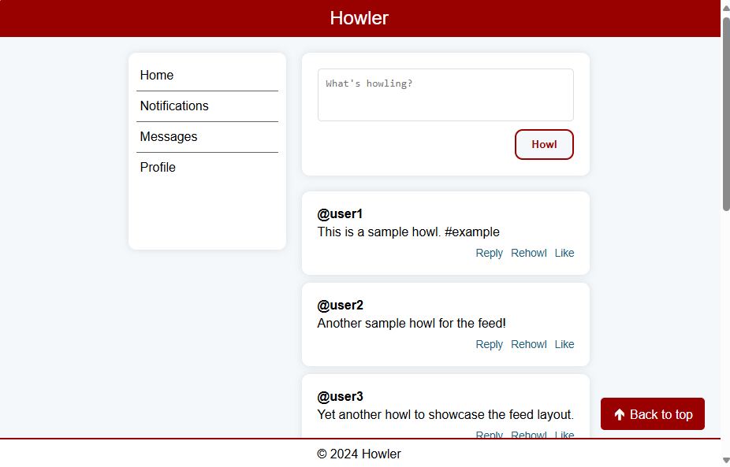

# Activity D04.a: Layout in CSS


In this activity, you will continue to practice CSS with a new focus on layouts and positioning.

## Activity Resources

1. [Flexbox](https://developer.mozilla.org/en-US/docs/Learn/CSS/CSS_layout/Flexbox) documentation on MDN
2. [Grid](https://developer.mozilla.org/en-US/docs/Web/CSS/CSS_Grid_Layout) documentation on MDN
3. Assets
   * [HTML Starter](files/index.html)
   * [CSS Starter](files/styles.css)

## Task: Apply CSS Styles

You are given an HTML file for a social media feed called Howler that you will need to style to achieve a result that looks like this:



There is no need to modify the HTML file at all. Here are some features you need to achieve and some hints to help you:

* The content should be centered on the page.
* The header and footer should always remain visible at the top and bottom of the page, respectively. (Hint: use the `position` CSS property)
* The "back to top" button should always be visible at the bottom right of the page regardless of scroll. (Hint: use the `position` CSS property)
* Clicking the "back to top" button should scroll the page to the top.
* The element with `id="top"` should not be visible on the page.
* Hint: use CSS grid for the `main` content. Using grid template areas will make it easier to position the content.
* Hint: the easiest way to get started with layout is to visually identify where each box is on the page. You can use the following temporary CSS rules for this (which are also hints--place these in the `styles.css` file to get started):
  ```css
  header {
    background-color: rgba(255, 0, 0, 0.1);
  }

  main {
    background-color: rgba(0, 255, 0, 0.1);
  }

  nav {
    background-color: rgba(0, 0, 255, 0.1);
  }

  #howl-input {
    background-color: rgba(255, 0, 255, 0.1);
  }

  #howl-list {
    background-color: rgba(255, 255, 0, 0.1);
  }

  .howl {
    background-color: rgba(0, 255, 255, 0.1);
  }

  footer {
    background-color: rgba(0, 0, 255, 0.1);
  }
  ```

### Steps

1. Create a new folder in your repository's Scratch Pad under today's folder for this activity.
2. Download the HTML starter files from the resources above and place them in the new folder.
3. Add CSS rulesets to `styles.css` to style the content of the HTML file to achieve the result shown above.
   1. Start by styling the `main` element making it a grid container. Hint: you will want this to be a 2x2 grid.
   2. Another thing you'd want to work out early is the back to top button and top anchor.
   3. Focus on the header and footer next.
   4. Finally, finish up the rest of the styles. Hint: you can use the `list-style-type` CSS property to remove the bullets from the list.


## Bonus

Style the navigation section on the left to remain in that position when the feed is scrolled.