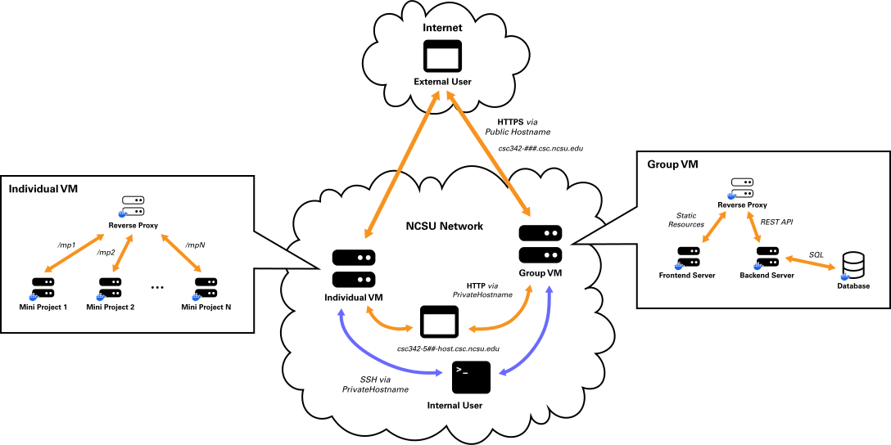

# CSC 342 Virtual Machine Instructions

You will have access to both an individual VM and a group VM. These instructions apply to both, as the only difference between them will be who is able to access each.

Your VM assignments can be viewed here in the [Class Portal](https://go.ncsu.edu/csc342-site). Note that you will need to be on a campus network (on campus or connected to the [VPN](https://vpn.ncsu.edu/)) to access this resource.

## Description of the VM environment

Your VM is running Ubuntu Linux and is configured to be accessed via SSH with your Unity credentials. Git and Docker are already installed and available for you to use.

Every VM has two corresponding hostnames with specific purposes and restrictions outlined below. Note that `###` should be replaced with the 3-digit number assigned to you or to your team by the teaching staff.

### `csc342-###-host.csc.ncsu.edu`

This hostname is only accessible from within the NCSU network (campus network or [VPN](https://vpn.ncsu.edu/)). This is the hostname you will use most often as it will allow you to access your VM via SSH or plain HTTP. **This hostname is not configured to serve content over HTTPS.**

Once you have your VM configued to listen on the standard HTTP port, you should be able to see your content on [http://csc342-###-host.csc.ncsu.edu/](http://csc342-###-host.csc.ncsu.edu/).

### `csc342-###.csc.ncsu.edu`

This hostname is accessible from anywhere (in and out of campus), but will only respond to web traffic (ports 80 and 443). **This means you will not be able to SSH into your VM via this hostname, even if you are on campus or cpnnected to the VPN.** There are two main uses for this hostname:

1. **HTTPS Support:** This hostname is configured to redirect HTTP traffic to HTTPs. You will use this to test certain features that the browser disallows on unsecured connections.
2. **Unrestricted Web Access:** since this domain responds to web traffic without being on campus or on the VPN, you can use it to test your web apps when not on campus on mobile devices where you may not have the VPN client installed.

Once you have your VM configued to listen on the standard HTTP port, you should be able to see your content on [https://csc342-###.csc.ncsu.edu/](https://csc342-###.csc.ncsu.edu/).

Here's a depiction of this infrastructure for both indiviudal and team VMs:

 

## Setting Up Your VM

You should follow the instructions on our [Class Portal](https://go.ncsu.edu/csc342-site) to set up your repository on your VM. Additional instructions will be given on each class assignment.

## Optional: SSH Key Authentication

You are encouraged to set up key-based authentication to SSH into your VMs. This has the advantage of automatically authenticating you when you attempt to SSH so that you don't have to enter your credentials each time. To do this, carefully read and follow the instructions on [this tutorial](https://www.digitalocean.com/community/tutorials/how-to-configure-ssh-key-based-authentication-on-a-linux-server).