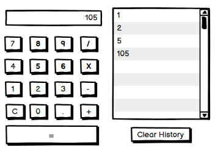

# Mini Project 2: Basic Calculator

For this assignment you will explore the fundamentals of JavaScript, DOM manipulation and event handling. You will also deploy this application to a remote host to run on Docker.

**The assignment is due Friday, September 20th, before midnight.**

---

## Part 1: Calculator

Develop a basic web-based calculator with computation history. You are free to design your calculator in any way you want, including adding more UI elements to make your calculator more useful, but here’s an example of a basic layout of the minimum it should contain:

 

The calculator itself should behave as all basic calculators do (e.g., you may want to include a `+/-` button to change the sign of a value). There is a `C` button that will reset the state of the calculator to start a new calculation. Input to the calculator can be provided either by pressing the buttons or by typing numbers (including decimal numbers) into the calculation text field.

There will also be a clickable "history" list in your app that will record values of intermediate computations for later use. An entry will be created in the following situations:

* **When you press the = button after a calculation.** For example, with the sequence of buttons `1 + 2 =` on a new calculation the list will have a new entry with value 3. But pressing the `=` button again will have no effect in this case until further calculations are performed.
* **When you press an operation button as part of a longer calculation.** For example, when performing a calculation with the sequence `1 + 1 + 1`, the second `+` will execute the first `1 + 1` with a partial result of `2`. This `2` should be added to the list. Note that pressing an operation button immediately after another operation button will override the previous operation selection. For example, these two sequences are equivalent:  `1 + 1` and `1 - + 1`.

In the example shown in the wireframe above, the state corresponds to the following sequence of button clicks: <pre>
1 * 1 <span style="color:red;">+</span> 1 <span style="color:red;">=</span> + 3 <span style="color:red;">+</span> 100 <span style="color:red;">=</span>
</pre> where the red inputs correspond to entries being created in the history list.

Clicking on an element in the history list should serve as input to the calculator when it is in a state ready to accept a new number. These states are

* First input to a calculation when the calculator is launched or after pressing the `clear (C)" button.
* When waiting for the second operand of a calculation, but before any number has been entered via buttons or typing.

Clicking on list items will otherwise have no effect. There will also be a "Clear History" button that, as the name suggests, will remove all elements in the history list.

These are additional constraints your implementation must follow:

* You can place UI elements anywhere you want in your page. Just make sure it’s usable and intuitive.
* Use CSS to give your calculator a polished look.
* Valid input consists of only numbers and operations. Typed input should be restricted to valid characters (i.e., the calculator will ignore input that is not valid).
* Perform, at least, all basic arithmetic operations shown above, but you can implement others if you want.
* Handle invalid operations properly and display the word `Error` as the result when this happens (e.g., no printing NaN or Infinity). When the calculator is in an error state, the user must press `C` before it can be used again.
* You will have a single HTML file called `index.html`.
* Your CSS and JavaScript should be in external files. No embedded or inline CSS/JS.
* You can use CSS fonts if you would like. No other external JavaScript or CSS is allowed.
* Use of `eval()` is not allowed. Parsing arithmetic expressions from strings is not required (and not recommended), and attempting to do so will make your implementation harder. See test cases below.
* Use flexbox or CSS grid as appropriate to construct the layout of your calculator. Do not use a `<table>` for layout.

### Test Cases

Here are some test cases you can use to test the correctness of your implementation. Note that this is not an exhaustive list and having your calculator correctly computing all of these does not guarantee that your implementation is correct.

* 111 + 000 = 111
* 0.5 + 0.6 = 1.1
* 111 + - 111 = 0
* \-100 + - 11 = -111
* 112 - 1 = 111
* \-10 - - 10 = -20
* 2 x 13 = 26
* 20 x - 15 = 5
* \-1 x - 5 = -6
* 15 x 0 = 0
* 30 ÷ 10 = 3
* 50 ÷ - 5 = 45

---

## Part 2: Running Your Calculator on Docker

To help with this portion of the assignment, we are providing your initial Docker configuration in the [MP2 folder](MP2). There are 2 steps you need to take to configure your repository for deployment.

1. **Proxy configuration:** The `proxy` folder contains files to build an [Nginx](https://nginx.org/) [reverse proxy](https://www.cloudflare.com/learning/cdn/glossary/reverse-proxy/) that will serve your assignments. You must copy this folder to the root of your repository.
2. **Docker Compose file:** The `compose.yml` file in [MP2 folder](MP2) contains initial configuration to get your assignments run on Docker. Place this file in the root of your repository.

After taking these steps, your repository should be structured as follows:

```
📦csc342-2024Fall-{unityId}
 ┣ 📂MiniProject0
 ┃ ┗ ...
 ┣ 📂MiniProject1
 ┃ ┗ ...
 ┣ 📂MiniProject2
 ┃ ┗ ...
 ┣ 📂proxy
 ┃ ┗ 📜default.conf.template
 ┣ 📂ScratchPad
 ┃ ┗ ...
 ┣ 📂images
 ┃ ┗ ...
 ┣ 📜.gitignore
 ┣ 📜compose.yml
 ┗ 📜README.md
```

You will not need to modify the files provided in [MP2 folder](MP2) for this assignment, but you should understand them as future assignments will require you to extend them on your own. We don't have a backend just yet, so these first couple of assignments will serve content statically via an Apache (httpd) image.

To run your calculator on Docker, you will run the following command in your repository root:

```bash
docker-compose up
```

After running this command, you should be able to access your calculator at [http://localhost/](http://localhost/) and [http://localhost/mp2](http://localhost/mp2). You should also be able to see your Mini Project 1 at and [http://localhost/mp1](http://localhost/mp1). You can stop your calculator by pressing `Ctrl+C` in the terminal.

## Part 3: Deployment on Docker

After properly structuring your repository, and after successfully, you should follow the instructions on [setting up your VM for this class](../HowTo/VM.md) and the [Class Portal](https://go.ncsu.edu/csc342-site) to run your code on your VM.

After running your code on your VM, you should be able to access your calculator at [http://csc342-###-host.csc.ncsu.edu](http://csc342-###-host.csc.ncsu.edu) and [https://csc342-###.csc.ncsu.edu/mp2](https://csc342-###.csc.ncsu.edu/mp2). You should also be able to see your Mini Project 1 at [https://csc342-###.csc.ncsu.edu/mp1](https://csc342-###.csc.ncsu.edu/mp1).

---

## Part 4: Screencast

Create a short (~3 min but no longer than 10 min; no minimum) screencast with the following content:

1. A brief demo of your calculator running in your VM highlighting interesting HTML, CSS styling decisions you made, and tricky JavaScript implementation aspects. Show that your implementation meets the requirements of the assignment. You can show your code in either VS Code or GitHub.
2. Comment on your implementation, including any struggles you encountered and how you resolved them. For example, you can mention:
   * What CSS+HTML techniques did you use on your layout and why did you choose to use these techniques?
   * Is everything working in your solution?
   * What, if anything, about your implementation would you change now that you have gone through this experience, and why?

Don't forget to commit and push your changes before starting your screencast!

For guidelines, software, and recommendations see [Screencasts](../HowTo/Screencasts.md).

---

## Submission

You will submit Parts 1 and 2 via your individual GitHub repository (portfolio) by creating a new `MiniProject2` folder, and adding Docker support files as described in Part 2 above. The `MiniProject2` folder will be structured as follows:

```
📦MiniProject2
 ┣ 📂css
 ┃ ┗ 📜your CSS file(s) here
 ┣ 📂images
 ┃ ┗ 📜any images here
 ┣ 📂js
 ┃ ┗ 📜your JavaScript file(s) here
 ┣ 📜index.html
 ┗ 📜README.md
```

Your screencast will be submitted via Moodle.

In your `README.md` files, add links to the `index.html` file. You can also use the `README.md` files to record some personal notes or observations about this assignment if you wish.

Make sure you commit and push your changes before the deadline! You can verify you have done this by navigating to GitHub's web interface and inspecting the state of your repository there.

**The assignment is due Friday, September 20th, before midnight.**