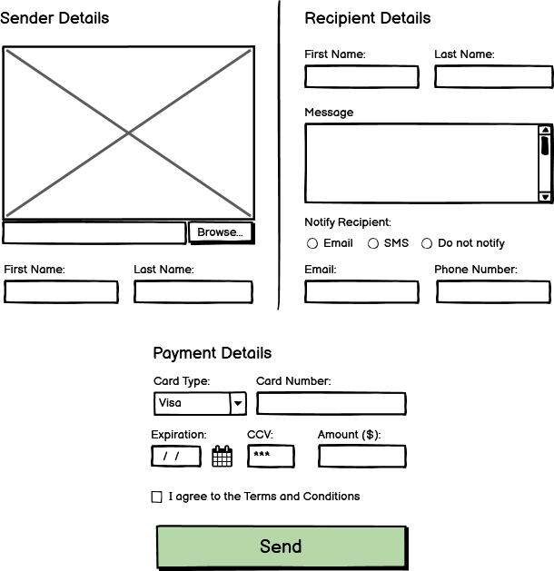

# Mini Project 3: Pay Your Friends

For this assignment you will create a simple app to simulate sending payments to a friend.

The only project dependencies allowed for this assignment are [Express](http://expressjs.com/) and [Multer](https://www.npmjs.com/package/multer) unless otherwise stated below.

**The assignment is due Friday, October 11th, before midnight.**

---

## Part 1: Front-end Form

For this part of the assignment you will use HTML, CSS and JavaScript to create, style, and validate an HTML form for this payment app in a file called `form.html`. You are welcome to be creative about the layout of your payment app, and you can include additional UI elements, but at a minimum it should contain the features illustrated in the wireframe below



The large box under Sender Details should display the preview of an image for upload that can be selected via the file input immediately below it. To help you with this feature, here are two alternatives you can consider: [https://www.tutorialspoint.com/preview-an-image-before-it-is-uploaded-in-javascript](https://www.tutorialspoint.com/preview-an-image-before-it-is-uploaded-in-javascript). Regardless of the method you choose, you should not use event attributes in your HTML, but instead use JavaScript to add event listeners to the file input element.

Your form should prevent the user from sending payment if certain conditions are not met. The validation requirements are as follows:

* Sender Details:
  * First and last names are required
  * A valid image is required
  * The image file cannot be larger than 200kb
* Recipient Details:
  * First and last names are required
  * A message is required and must be at least 10 characters long
  * The email field is optional unless "Notify recipient" is set to "Email"
  * The phone field is optional unless "Notify recipient" is set to "SMS"
* Payment Details:
  * All fields are required, including accepting the terms and conditions
  * The card number must follow format "XXXX-XXXX-XXXX-XXXX" where all Xs are numbers
  * The card must not be expired
  * The CCV should be 3 or 4 numbers, but should not be displayed to the user.
  * The amount should be a number, which may include decimal values


You will also create two additional pages `success.html` and `error.html`. You are encouraged to be creative with these, and the intention behind them is as their names suggest. One will be displayed when a payment is sent successfully and the other when it is not. More on this under Part 2 below, but you can see the basic folder structure for this assignment under the Submission section below.

---

## Part 2: Back-end

Your form should be served via a simple [Express](http://expressjs.com/) backend app. This server should statically serve CSS, images, and JavaScript stored in the `static` folder (see the Submission section below for a more complete folder structure description). HTML files should not be served statically, but instead be served behind routes.

1. `GET /`: will serve your payment form `form.html` from Part 1.
2. `POST /send`: this will be the target of your form data.

We have received reports of fraud from a specific user, so we have banned this user from our payment system. To handle this, your backend should also ensure that no payments are sent to Stuart Dent (sometimes he goes by Stu). When your backend detects a payment sent to this user (either "Stuart Dent" or "Stu Dent"), it should display the error page. Otherwise, your backend should store the uploaded image in the `uploads` folder (see folder structure below) and display the success page.

Remember to validate the form data on the server side as well! The validation requirements are the same as in Part 1.

### Bonus

If you are up to the challenge, we encourage you make your success page more dynamic by displaying on it the details of the successful payment, including the uploaded image. Here are a couple of suggestions:

1. If you are not feeling too adventurous, you can just construct your HTML as a string using data from the submitted form and return it on success.
2. For a more robust and scalable solution, you can use a view engine in your Express app, such as [Handlebars](https://www.geeksforgeeks.org/handlebars-templating-in-expressjs/) to turn your success page into a template that you can fill out with form data.

If you are interested in exploring this but not sure how to approach it, please ask questions! But focus on the core features of this assignment first.

---

## Part 3: Deployment on Docker and your VM

You will also deploy your assignment to run on Docker locally and in your virtual machine. This application has a backend, so we are no longer using the Apache (httpd) image to serve static files. Instead, you will have to create your own Docker image. To do this, you will need to:

1. Add a Dockerfile in your `MiniProject3` folder to create a Docker image for your Mini Project 3 Node.js app. Remember to install the dependencies of your project and to start your server when the container runs.
2. Add a new entry in your `compose.yml` file to create a container (service) for Mini Project 3 that builds the image from the previous step. Call this service `mp3` to keep it consistent with the previous assignments.
3. Modify your `default.conf.template` file to now also proxy path `/mp3/` to the new container from the previous step. You should also modify this file so that the path `/` is now proxying to Mini Project 3.

This means that your assignment must work when you navigate to `/` in your browser, and also when you navigate to `/mp3`. Similarly, all previous assignments should still work when you navigate to their respective paths.

---

## Part 4: Screencast

Create a short (~3 min but no longer than 10 min; no minimum) screencast with the following content:

1. A brief demo of your payment form running on your VM, highlighting interesting HTML, CSS styling decisions you made, and tricky JavaScript implementation aspects including your validation choices. Show that your implementation meets all of the requirements of the assignment, or mention which features are not working and why. You can show your code in either VS Code or GitHub.
2. Comment on your implementation, including any struggles you encountered and how you resolved them. For example, you can mention:
   * What techniques are you using to validate your form?
   * Is everything working in your solution? If not, what's missing, and how do you think it should be handled?

Don't forget to commit and push your changes to your repository and deploying them on your VM before starting your screencast!

For guidelines, software, and recommendations see [Screencasts](../HowTo/Screencasts.md).

---

## Submission

You will submit Parts 1 and 2 via your individual GitHub repository (portfolio) by storing all files inside a new `MiniProject3` folder. This folder will be structured as follows:

```
📦MiniProject3
 ┣ 📂static
 ┃ ┣ 📂css
 ┃ ┃ ┗ 📜your CSS file(s) here
 ┃ ┣ 📂images
 ┃ ┃ ┗ 📜any images here
 ┃ ┣ 📂js
 ┃ ┃  ┗ 📜your JavaScript file(s) here
 ┃ ┗ 📂uploads
 ┃   ┗ 📜uploaded images stored here
 ┣ 📂templates
 ┃ ┣ 📜error.html
 ┃ ┣ 📜form.html
 ┃ ┗ 📜success.html
 ┣ 📜server.js
 ┣ 📜package.json
 ┣ 📜Dockerfile
 ┗ 📜README.md
```

It's okay to also include your `package-lock.json` file. Part 3 will be submitted via your VM.

Your screencast will be submitted via Moodle.

In your `README.md` files, add links to the `form.html` file for easy access. You can also use the `README.md` files to record some personal notes or observations about this assignment if you wish.

Make sure you commit and push your changes before the deadline! You can verify you have done this by navigating to GitHub's web interface and inspecting the state of your repository there.

**The assignment is due Friday, October 11th, before midnight.**