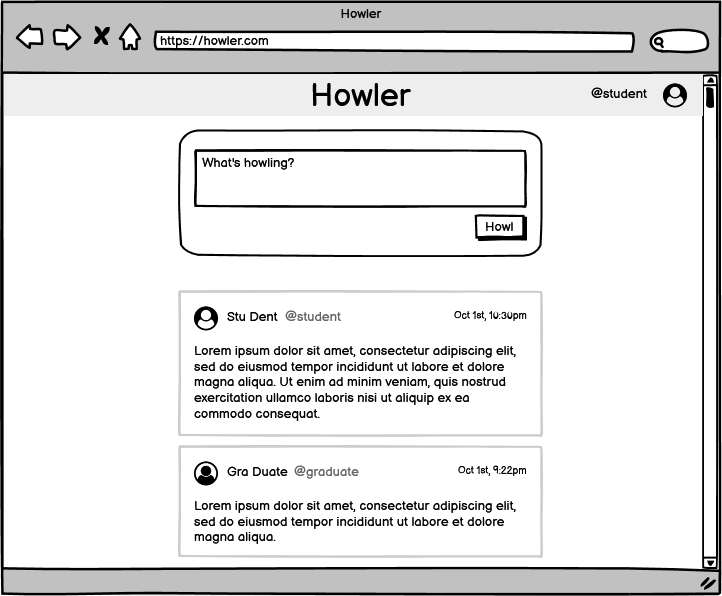
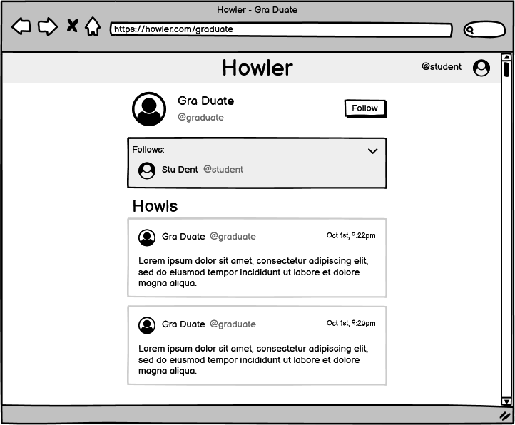

# Mini Project 4: Howler

For this assignment you will create a basic client-side rendered social network app called Howler. If Twitter is for birds, Howler is for wolves.

You will design and implement a REST API for Howler based on provided mock/initial data, and you will design and implement a frontend that consumes this API to provide functionality.

**The assignment is due Friday, November 1st, before midnight.**

---

## How Does Howler Work?

Howler allows users to post a "howl": a text entry of what's on their mind. Users can also read what other users have "howled" in reverse chronological order (newest at the top) by visiting that user's profile page. Users can also follow/unfollow other users, and the home page for one user will display all of their own howls and the howls from all users they follow, all sorted in reverse chronological order. To support this functionality, Howler's views include the following:

### Login Page

Howler requires the user to log in before posting or viewing content. It's okay if Howler is not secure at this stage, so long as you can identify the current user.

### Main Page

This is the main view of Howler and allows users to post a new howl and view howls of users they follow (not all users) together with their own howls, all sorted in reverse chronological order. Here's a wireframe:



### User Profile Page

Users can view other users' profiles, which will contain their name, username, a list of users they follow, and will display the howls posted by that user in reverse chronological order. If the logged-in user follows the owner of a profile, this page will display an indication of that and the ability to unfollow. Otherwise, there should be an option to follow the user so that their howls will be displayed in the logged-in user's main page. A user can view their own profile page, but they cannot follow/unfollow themselves. The user profile page can look like this:



## Description of the Data

Mock/initial data is provided in the [MP4 folder](MP4) in 3 files: `users.json`, `howls.json`, and `follows.json`. The first file, `users.json`, contains an array of all users in the system. Here's an example of a user record:

```json
{
  "id": 1,
  "first_name": "Stu",
  "last_name": "Dent",
  "username": "student",
  "avatar": "https://robohash.org/veniamdoloresenim.png?size=64x64&set=set1"
}
```

You can assume that `id` and `username` are unique for each user. The `avatar` entry is the URL of an image the user has chosen for their profile.

The second file, `howls.json`, contains previous howls from users in the system. A howl entry looks like this:

```json
{
  "id": 1,
  "userId": 7,
  "datetime": "2022-05-29T03:50:25Z",
  "text": "Donec odio justo, sollicitudin ut, suscipit a, feugiat et, eros. Vestibulum ac est lacinia nisi venenatis tristique. Fusce congue, diam id ornare imperdiet, sapien urna pretium nisl, ut volutpat sapien arcu sed augue. Aliquam erat volutpat."
}
```

Each howl has a unique `id` and the user who posted it is identified by `userId`, which corresponds to the `id` attribute of the user entry. There is a `datetime` entry indicating the timestamp when the howl was posted and `text` contains the howl itself.

Finally, `follows.json` contains the initial data for users following other users. It's a big object keyed on the IDs of users. For example, consider this smaller "`follows`" object:

```json
{
  "1": {
    "userId": 1,
    "following": [
      24,
      6,
      7
    ]
  },
  "2": {
    "userId": 2,
    "following": [
      4,
      12
    ]
  }
}
```

This says that user with ID 1 follows users with IDs 24, 6, and 7, while user with ID 2 follows users with IDs 4 and 12. In JavaScript, you can use this object (let's call it `follows`) like this:

```javascript
// Get users followed by user with ID 1:
let user1Follows = follows["1"].following; //returns [24, 6, 7]

// Make user with ID 1 follow user with ID 3
follows["1"].following.push(3);
```

JSON files can be imported into a JavaScript CommonJS module like this:

```javascript
let data = require('./data.json');
```

## Part 1: REST API

You must design a REST API for Howler to support its functionality and implement it in [Express](http://expressjs.com/). For this part, create a new Express server project and organize your code in modules. Routes should not be defined in your main server file; use `express.Router()` instead. Make sure your API is mounted under the `/api` base route to avoid it colliding with your view (frontend) routes or static resources (i.e., all API URLs will start with `/api`).

When it runs, your API will load the provided JSON files to populate its initial state. Remember that, for this assignment, your API will store all its data in memory (new howls, follows and unfollows after initial load), so it will revert to the initial/mock data once the server is restarted.

You will need endpoints for at least the following:

* "Authenticating" a user. For this assignment, just receive a username and verify that it corresponds to one of the existing users to grant access.
* Getting the currently "authenticated" user's object.
* Creating a new howl.
* Getting howls posted by a specific user
* Getting howls posted by all users followed by the "authenticated" user
* Getting a specific user's object
* Getting the list of users followed by a specific user
* Following a user
* Unfollowing a user

Your particular design may require slightly different or even additional endpoints. Make sure you used a layered design with appropriate abstractions to make your API easier to implement.

No libraries or frameworks other than Express, `cookie-parser`, `multer`, and `nodemon` are allowed in your backend, but you can use Node.js built-in modules and any other custom modules you create.

---

## Part 2: Frontend

For this part you will create Howler's web interface using [Bootstrap](https://getbootstrap.com/) for styling, and you will use this frontend to consume the API you created in Part 1. Your interface should be responsive, which means it must accommodate being rendered on a desktop browser as well as on a mobile browser. Bootstrap can help with this when used properly. You can follow the wireframes above as closely or as loosely as you want as long as your interface is aesthetically pleasing and functionally unobtrusive. To make Bootstrap available in your app, include this code in each of your pages:

```html
<link href="https://cdn.jsdelivr.net/npm/bootstrap@5.2.1/dist/css/bootstrap.min.css" rel="stylesheet" integrity="sha384-iYQeCzEYFbKjA/T2uDLTpkwGzCiq6soy8tYaI1GyVh/UjpbCx/TYkiZhlZB6+fzT" crossorigin="anonymous">
<script src="https://cdn.jsdelivr.net/npm/bootstrap@5.2.1/dist/js/bootstrap.bundle.min.js" integrity="sha384-u1OknCvxWvY5kfmNBILK2hRnQC3Pr17a+RTT6rIHI7NnikvbZlHgTPOOmMi466C8" crossorigin="anonymous"></script>
```

No other external libraries or frameworks are allowed for this assignment.

While Bootstrap will provide a stylistic foundation and useful CSS you can readily use (be sure to consult [the documentation](https://getbootstrap.com/docs/5.2/getting-started/introduction/)), you will also have to write your own CSS to customize the default look and for specific needs of your application. Remember that Bootstrap is a generic framework intended to provide general use styles, but your app's specifics require custom styles.

You will use the same server you created for your REST API to also serve your frontend. Your server should not serve HTML files statically. Instead, routes must be used (e.g., http://localhost/about instead of http://localhost/about.html). Consider declaring your API routes separately from your frontend routes (i.e., in separate files). Remember that Howler should be client-side rendered, so data will be populated on your pages from your REST API instead of directly embedded in the HTML that is sent by your server.


---

## Part 3: Deployment on Docker and your VM

You will also deploy your assignment to run on Docker in your virtual machine. To do this, you will need to:

1. Add a Dockerfile in your `MiniProject4` folder to create a Docker image for your Mini Project 4 Node.js app. Remember to install the dependencies of your project and to start your server when the container runs.
2. Add a new entry in your `compose.yml` file to create a container (service) for Mini Project 4 that builds the image from the previous step. Call this service `mp4` to keep it consistent with the previous assignments.
3. Modify your `default.conf.template` file to now also proxy path `/mp4/` to the new container from the previous step. You should also modify this file so that the path `/` is now proxying to Mini Project 4.

---

## Part 4: Screencast

Create a short (~5 min but no longer than 10 min; no minimum) screencast with the following content:

1. A brief demo of your implementation of Howler showing that it meets the requirements of the assignment. Show that your app runs on your VM.
2. A walkthrough of your code in either VS Code or GitHub. Focus on the interesting parts of your implementation on both the frontend and backend.
2. Comment on your implementation, including any struggles you encountered and how you resolved them. For example, you can mention:
   * How are you preserving your app's state (new howls, changes in follows)?
   * Is everything working in your solution? If not, what's missing?
   * What, if anything, about your implementation would you change now that you have gone through this experience, and why?

Don't forget to commit and push your changes before starting your screencast!

For guidelines, software, and recommendations see [Screencasts](../HowTo/Screencasts.md).

---

## Submission

You will submit Parts 1 and 2 via your individual GitHub repository (portfolio) by storing all files inside a new `MiniProject4` folder. This folder will be structured as follows:

```
📦MiniProject4
 ┣ 📂static
 ┃ ┗ 📜your static resource(s) here
 ┣ 📂src
 ┃ ┣ 📂data
 ┃ ┃ ┣ 📜follows.json
 ┃ ┃ ┣ 📜howls.json
 ┃ ┃ ┗ 📜users.json
 ┃ ┣ 📜other server files and folders here
 ┃ ┣ 📜routes.js
 ┣ 📂templates
 ┃ ┗ 📜your HTML file(s) here
 ┣ 📜server.js
 ┣ 📜package.json
 ┣ 📜Dockerfile
 ┗ 📜README.md
```

Your screencast will be submitted via Moodle. Part 3 will be submitted via your VM.

In your `README.md` file, write briefly about:

1. An interesting challenge you encountered when implementing Howler. What was the issue, and how did you solve it?
2. What additional feature would you add to Howler, and how would you suggest it should be implemented?

Make sure you commit and push your changes before the deadline! You can verify you have done this by navigating to GitHub's web interface and inspecting the state of your repository there.

**The assignment is due Friday, November 1st, before midnight.**