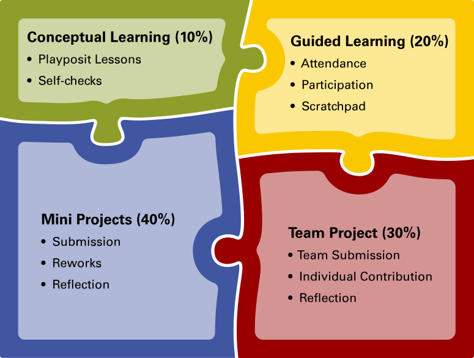

# CSC 342 – Applied Web-based Client-Server Computing

**Section 001**

**Fall 2024**

**3 Credit Hours**

## Course Description

This course explores client-server computing on the World Wide Web. The course focuses on the architecture of Web-based full-stack applications as well as currently accepted industry's best practices. Students gain practical exposure to concepts, tools, and technology associated with Web development through hands-on projects.

The course will cover a wide range of Web development topics, including

* Overview of the Internet
* Static Webpages: HTML, CSS, accessibility, responsiveness
* HTTP, REST, and forms
* JavaScript, the DOM & Web APIs
* Modern front-end & back-end frameworks
* Persistence, authentication & sessions
* Animation & visualization
* WebSockets
* Configuring and operating a Web server
* Advanced Web architectures

## Learning Objectives

Upon successful completion of this course, a student will be able to:

* CO1: Design and implement responsive websites using a descriptive mark-up language, CSS, and JavaScript.
* CO2: Describe modern Web communication protocols (e.g., HTTP, APIs over HTTP, and WebSockets) and use them when developing Web applications.
* CO3: Create client-side and server-side programs to deliver and display dynamic content for Web pages.
* CO4: Implement and deploy secure and scalable Web applications.
* CO5: Apply different Web-based client-server architecture concepts.
* CO6: Investigate and apply emerging architectures and technologies for Web-based client-server applications.

## Requisites and Restrictions

### Prerequisites

* CSC 216 with a grade of C or better.

### Co-requisites

* None.

### Restrictions

* None.

## Additional Concerns

### Transportation

This course will not require students to provide their own transportation. Non-scheduled class time for field trips or out-of-class activities is NOT required for this class.

### Safety & Risk Assumptions

None.

## Course Overview

### Instructor

**Dr Ignacio X. Domínguez** (ixdoming) 
**Email:** [ignacioxd@ncsu.edu](mailto:ignacioxd@ncsu.edu) 
**Web Page:** [https://go.ncsu.edu/ignacioxd](https://go.ncsu.edu/ignacioxd:342) 
**Phone:** (919) 515-7354 
**Office Location:** 3256, Engineering Building II (EB2) 
**Office Hours:** See course Google calendar

### Teaching Assistants

**David Adei** (dahmed) 
**Email:** [dahmed@ncsu.edu](mailto:dahmed@ncsu.edu) 
**Office Hours:** See course Google calendar

**Zhouyu Li** (zli85) 
**Email:** [zli85@ncsu.edu](mailto:zli85@ncsu.edu) 
**Office Hours:** See course Google calendar

**NOTE:** While email addresses are provided for completeness, please use Discord or the class support email ([csc-342-001-fall-2024-support@wolfware.ncsu.edu](mailto:csc-342-001-fall-2024-support@wolfware.ncsu.edu)) for all course-related correspondence. This is to ensure that we can provide timely, high quality responses!

### Course Meetings

**Days:** M/W 
**Time:** 10:15am - 11:30am 
**Campus:** Centennial 
**Location:** 135 Biomanufacturing Training And Education Center (BTEC) 
_This meeting is required._

### Course Materials

#### Textbooks

* None.

#### Expenses

* None.

#### Materials

* None.

## Coursework & Evaluation

We will have a mixture of pre-recorded lectures and in-class activities and demonstrations. Before class, you will watch recordings that cover core concepts related to a topic. During class, you will work on activities and example exercises with relevant tools that reinforce conceptual material. You are expected to work on these exercises in class on your personal laptop. Outside of class, you will work on individual mini projects and a semester-long team project.

## Student Portfolios

You will submit all coursework electronically via provided GitHub repositories and Moodle. Each student will have access to two repositories: one for individual work and another for a group project. The individual repository will serve as a compilation of each individual student's work throughout the entire semester—a portfolio.

### Individual Mini Projects

Individual mini projects will be regularly released throughout the semester to reinforce class material. Mini Projects will typically mirror a scenario or common task that a Web developer may face.

Mini Projects must be submitted electronically by the due date. Software artifacts will be submitted via GitHub, but some assignments may have other components that will be submitted separately (e.g., via Moodle). Each Mini Project will identify how deliverables must be submitted, and it is your responsibility to ensure you can meet the due dates for each component. A submission will only be considered on time if all components are submitted before the deadline. In other words, **read the instructions carefully** and plan ahead. **Do NOT wait until the last minute to begin your assignments.**

Your individual repository will include a folder for each Mini Project in the semester where you will store software artifacts, companion instructions, and other materials as requested for each assignment. You are expected to maintain a structure that is easy to navigate and follow. This will help you make more effective use of this repository as a portfolio that you can showcase, and will make it easier for the teaching staff to navigate as we evaluate and provide feedback.

### Team Project

You will work in teams of 3 to design, develop, and deploy a Web application. The project will incorporate elements learned throughout the semester but may also include concepts beyond the scope of the topics in the class (e.g., use Web APIs we did not have time to cover). A separate group repository will be provided for electronic submissions. You will be asked to incorporate this project into your portfolio by linking from your individual repository to your group repository.

The team project will have several milestones that must be submitted by their due dates. Details and requirements for each milestone will be released throughout the course. A final demo of your project will be presented at the end of the semester by each team, and every member of the team is required to deliver a portion of this presentation.

Every team member is expected to contribute in equal measure to their group project. Task assignment should be decided among the team, but each team member is responsible for completing work agreed upon and for fulfilling each other's expectations as a teammate. For each milestone, you will be required to provide statements of individual contributions and may be required to submit confidential peer evaluations.

### In-Class Activities & Personal Projects

The majority of class time will be spent working on in-class activities using your laptop. Your personal repositories will have a dedicated folder where you _must_ store these in-class activities. **You are required to store artifacts from these class activities in your repository**, as instructed on each activity, on the same day the class is held. These will serve as resources for you to refer back to when working on your assignments, but they will also serve as a measure of your progress, understanding of the material, and engagement with the class throughout the semester.

The best way to learn in this class is by applying and practicing the concepts via experimentation through implementation. You will find that, many times, creating small projects (e.g., toy projects or proofs of concept) will help solidify your mental model and understanding of how technologies operate or relate. You may create a small prototype, for example, to investigate how to design and structure code to satisfy a portion of an assignment. The expectation is that this will provide freedom of experimentation by reducing the risk of "breaking" some of your actual assignments.

Although these prototypes and code experiments are not part of assignments directly, they still form part of your learning journey in this course. To account for this work, your personal repository will have a dedicated folder where you _may_ store these personal experiments–conceptual sandboxes–not only for your future reference but also to illustrate your learning process. This is completely optional; **you are not required to keep track of these code experiments**, and these will not be considered part of any specific assignment.

## (Un)Grading

The teaching staff will not assign letter grades to your work in this class. Instead, you will receive qualitative feedback on the submitted versions of Mini Projects and project deliverables, and can request feedback on work-in-progress, on what is not working or looking as expected and how to improve it. Feedback given on an assignment is expected to be incorporated into all future assignments (individual and team) and later submissions of the same assignment (reworks).

Each assignment will have an opportunity for self-reflection where you will be asked to, at the minimum, rate your work on the following scale:

1. Exceeds Expectations
2. Meets Expectations
3. Does Not Meet Expectations

If your assignment is 100% complete and all requested features are working perfectly, your assignment will "meet expectations". If anything is missing or not working as expected, your assignment will not meet expectations. Assignments will only exceed expectations if they are correct and complete, and you incorporated elements to improve the work beyond what was required (e.g., adding new features to enhance a solution). You will be asked to demonstrate your work to support your self-assessment.

These ratings and all feedback received from the teaching staff will allow you to monitor your own progress in this class.

### Final Term Grade

The University requires that I submit a final letter grade for your transcript. Near the end of the semester, you will submit a recording of a brief (~15min) screencast reflecting on what you learned in this class. This video will include live demonstrations of deployed working code in your portfolio and your contributions to your group project—including explanations of interesting code artifacts—as evidence of this learning. These demos should showcase required functionality for each assignment and possibly also interesting code sections to demonstrate your understanding. Using appropriate terminology, as defined in class, is expected. With this video as support, you will suggest the term grade that will go into your transcript.

You must provide concrete evidence to substantiate your proposed term grade. This evidence comes in the form of artifacts you have produced during the semester for this class, including running demos of your deployed work, implementation details, answers to any conceptual or written prompts, and reflections. In other words, you will need to support your proposed grade in your demonstrated classwork. Previous assignments, in-class activities, personal projects, and your group project will help with this justification.

Different coursework should be weighted differently in your term grade proposal. For example, your individual work will be weighted more heavily than your team project. Here is a breakdown of the weight of each component in your term grade proposal:

#### Conceptual Learning: 10%

This component includes all the work that must be completed before class. You are expected to watching all pre-recorded lectures before class, correctly completing in-video prompts. You must also correctly answer all self-check quizzes.

#### Guided Learning: 20%

This component includes your attendance and participation class, complete and correct solutions to all in-class activities stored in the scratchpad folder of your portfolio, and completion of any personal projects also in your scratchpad.

#### Mini Projects: 40%

This component includes all correct and complete individual mini projects. It also includes any reworks and improvements you made by the appropriate due dates. You have a space in your ungrading portfolio to record your reworks, which you shall show in your final term grade proposal video.

#### Team Project: 30%

This component includes all correct and complete team project milestones, focusing on your individual contributions. It also includes completed confidential peer evaluations, as prompted in your individual ungrading portfolio.

#### Proposing Your Final Term Grade

Your final term grade proposal and justification video must be submitted no later than the date indicated in the class schedule, but may be submitted at any time starting on the day after the last day of class. Students who do not submit a final term grade proposal on time will receive a grade of F for the course (or U if taking the class for credit only). No late submissions are accepted.

**NOTE:** The teaching staff reserves the right to veto/override your proposed grade if we consider it misrepresents the quality of your work throughout the semester. We may:

* Increase your proposed grade if you are being too harsh on yourself
* Lower your proposed grade if you are being too generous with yourself

In the rare event that your proposed grade is deemed not to represent the quality of your work, the teaching staff will inform you and may schedule a meeting with you to discuss further.

**Proposing a higher grade than what is reasonably supported by demonstrated quality of work will be considered an academic integrity violation.**

## Other Grading Policies

### Requirements for Credit-Only (S/U) Grading

In order to receive a grade of S, students are required to complete all assignments, and earn a grade of C- or better. Conversion from letter grading to credit only (S/U) grading is subject to university deadlines. Refer to the Registration and Records calendar for deadlines related to grading. For more details refer to [http://policies.ncsu.edu/regulation/reg-02-20-15](http://policies.ncsu.edu/regulation/reg-02-20-15).

### Requirements for Auditors (AU)

Information about and requirements for auditing a course can be found at [http://policies.ncsu.edu/regulation/reg-02-20-04](http://policies.ncsu.edu/regulation/reg-02-20-04).

### Policies on Incomplete Grades

If an extended deadline is not authorized by the instructor or department, an unfinished incomplete grade will automatically change to an F after either (a) the end of the next regular semester in which the student is enrolled (not including summer sessions), or (b) the end of 12 months if the student is not enrolled, whichever is shorter. Incompletes that change to F will count as an attempted course on transcripts. The burden of fulfilling an incomplete grade is the responsibility of the student. The university policy on incomplete grades is located at [http://policies.ncsu.edu/regulation/reg-02-50-3](http://policies.ncsu.edu/regulation/reg-02-50-3).

## Course Policies

### Recording of Lectures

The University may automatically record all class sessions, but these are not made available to students by default. At the instructor's discretion, and when a student has a documented need for this accommodation (such as an excused absence), the student may be granted access to some of these recordings, if any. 

**Students are not permitted to record in class without the instructor's prior explicit permission.** This includes audio and/or video recordings, as well as screen captures or other forms of lecture capture of entire lectures or portions of lectures.

### Late Assignments

Late assignments are not accepted unless an extension is granted by the instructor before the due date. You are expected to submit all assignments by their indicated due date. An assignment will only be considered on time if all components (GitHub commit, Moodle quiz, etc.) are submitted before the deadline. **Submission timeliness shall factor into your term grade.** Assignments (or portions of assignments) submitted via GitHub should be committed and pushed by the due date to be considered on time. Feedback on assignments is only guaranteed for submissions made on time unless an extension is granted by the instructor before the due date.

**Email submissions of work are never accepted regardless of whether an extension has been granted.** If you are unable to submit your work as requested, you must contact the instructor before the due date to make alternative arrangements.

### Reworked Assignments

You will have the opportunity to improve the quality of your submitted work by reworking assignments to incorporate feedback provided by the teaching staff and/or to work on completing missing requirements. You may request additional feedback on reworked assignments provided that the original submission was made on time. The rework must be submitted within two weeks of receiving feedback on the previous version or before November 22nd, whichever is earlier.

Even if your original submission was not made on time, we still encourage you to revisit and rework your assignments to improve your understanding of the material. However, you will not receive formal feedback on these late submissions.

### Attendance and Absence Policy

Attendance to all class sessions is mandatory and **unexcused absences shall factor into your proposed term grade**. All anticipated absences must be presented to the instructor no later than one week before the absence, and they will be considered excused at the instructor's discretion and based on current University and departmental policies. For unanticipated absences, you are responsible for contacting the instructor and submitting an [absence verification request](https://dasa.ncsu.edu/support-and-advocacy/find-help/absence-notification/) as soon as possible.

For complete attendance and excused absence policies, please see [http://policies.ncsu.edu/regulation/reg-02-20-03](http://policies.ncsu.edu/regulation/reg-02-20-03).

### Policy on Use of Artificial Intelligence

This course permits you to use artificial intelligence (AI) tools, such as chatbots, text generators, paraphrasers, summarizers, or solvers, to get guidance on assignments, as long as you do so in an ethical and responsible manner. Essentially, you can think of these tools as ways to help you learn but not to generate answers for assignments, discussion board posts, essays, coding activities, presentation slides, and so on. AI is more like your tutor or TA, not a replacement for your independent thinking.

This means that you must:

* Not use AI tools to replace your own thinking or analysis or to avoid engaging with the course content.
* Cite or explain any AI tools you use. Provide the name of the AI tool, the date of access, the URL of the interface, and the specific prompt or query you used to generate the output. 
* Be transparent and honest about how you used the AI tool and how it contributed to your assignment. Explain what you learned from the AI tool, how you verified its accuracy and reliability, how you integrated its output with your own work, and how you acknowledged its limitations and biases.
* You are accountable for any mistakes or errors made by the AI tool. Always check and edit the output before submitting your work. If you are unsure about the accuracy or reliability of the AI tool, consult with the instructor before using it.

Using AI tools in an unethical or irresponsible manner, such as copying or paraphrasing the output without citation or transparency, using the output as your own work (especially without verification or integration), or using the output in a way that misrepresents your knowledge or skills, is considered a form of academic dishonesty. If you have any questions about what constitutes ethical and responsible use of AI tools, please consult with the instructor before submitting your work.

## Academic Integrity

### Academic Integrity

Students are required to comply with the university policy on academic integrity found in the Code of Student Conduct found at [http://policies.ncsu.edu/policy/pol-11-35-01](http://policies.ncsu.edu/policy/pol-11-35-01)

**All members of the University community, students, faculty and other employees, have the responsibility to report academic misconduct to the appropriate authority.**

Students are expected to behave professionally and respectfully at all times, in class, on campus, online, and in course feedback surveys and student evaluations. That means there is to be no offensive language, no threats, and absolutely no discussion/hints/threats of violence or discrimination. Disrespectful language will not be tolerated and will be reported to Campus Police if the instructor deems that such language may be harmful to the psychological well-being of others or represents a need for assistance by the offending student.

I encourage you to read the ACM Code of Ethics, particularly Sections 1.3, 1.5, 1.6, 2.2 and 2.4. ([http://www.acm.org/constitution/code.html](http://www.acm.org/constitution/code.html))

**Proposing a higher grade than what is reasonably supported by demonstrated quality of work will be considered an academic integrity violation.**

#### What are the Consequences of Academic Misconduct?

_**Students who commit an academic integrity violation will receive no credit for the entire course.**_

All cases of academic misconduct will be reported to the Office of Student Conduct. A first offense will place the student on **Academic Probation** for the remainder of their academic career. Academic Probation is not visible on a student's transcript or other educational record, but the Office of Student Conduct does supply this information for various campus agencies running checks for disciplinary standings. If the student is **suspended**, which will likely happen on a second academic integrity infraction, the Office of Student Conduct may notify many other departments on campus, such as Registration & Records, Housing, Campus Health, Counseling, and Financial Aid. In addition, administrators of some scholarships routinely ask the Office of Student Conduct to confirm whether the student is in good standing.

### Honor Pledge

Your signature on, or submission of, any test, activity, or assignment indicates "I have neither given nor received unauthorized aid on this test or assignment."

## Digital Course Components

Students may be required to disclose personally identifiable information to other students in the course, via digital tools, such as email or Web-postings, where relevant to the course. Examples include online discussions of class topics, and posting of student coursework. All students are expected to respect the privacy of each other by not sharing or using such information outside the course.

**Digital Course Components:** Moodle, Discord, GitHub

## Accommodations for Disabilities

Reasonable accommodations will be made for students with verifiable disabilities. In order to take advantage of available accommodations, students must register with the Disability Resource Office at Holmes Hall, Suite 304, Campus Box 7509, 919-515-7653. For more information on NC State's policy on working with students with disabilities, please see the Academic Accommodations for Students with Disabilities Regulation (REG02.20.01) ([https://policies.ncsu.edu/regulation/reg-02-20-01/](https://policies.ncsu.edu/regulation/reg-02-20-01/)).

## Non-Discrimination Policy

NC State provides equal opportunity and affirmative action efforts, and prohibits all forms of unlawful discrimination, harassment, and retaliation ("Prohibited Conduct") that are based upon a person's race, color, religion, sex (including pregnancy), national origin, age (40 or older), disability, gender identity, genetic information, sexual orientation, or veteran status (individually and collectively, "Protected Status"). Additional information as to each Protected Status is included in NCSU REG 04.25.02 (Discrimination, Harassment and Retaliation Complaint Procedure). NC State's policies and regulations covering discrimination, harassment, and retaliation may be accessed at [http://policies.ncsu.edu/policy/pol-04-25-05](http://policies.ncsu.edu/policy/pol-04-25-05) or [https://oied.ncsu.edu/divweb/.](https://oied.ncsu.edu/divweb/) Any person who feels that he or she has been the subject of prohibited discrimination, harassment, or retaliation should contact the Office for Equal Opportunity (OEO) at 919-515-3148.

## Trans Inclusive Classroom

In an effort to affirm and respect the identities of transgender students in the classroom and beyond, please contact me if you wish to be referred to using a name and/or pronouns other than what is listed in the student directory.

Additionally, all students should respect the stated names and pronouns of classmates.

## Class Evaluation

Online class evaluations will be available for students to complete during the last 2 weeks of the semester (from Tuesday, November 19, at 8am until Thursday, December 5, at 8am). Evaluations then become unavailable at 8 am on the first day of finals.

Students will receive an email message directing them to a website where they can log in using their Unity ID and complete evaluations. All evaluations are confidential; instructors will not know how any one student responded to any question, and students will not know the ratings for any instructors.

| Resources             |   |
| --------------------- | --- |
| Evaluation website:   | [http://go.ncsu.edu/cesurvey](http://go.ncsu.edu/cesurvey) (Login Required) |
| Student help desk:    | [classeval@ncsu.edu](mailto:classeval@ncsu.edu) |
| Info about ClassEval: | [http://www2.acs.ncsu.edu/UPA/classeval/index.htm](http://www2.acs.ncsu.edu/UPA/classeval/index.htm) |

On occasion, students may additionally be asked to complete mid-semester class evaluations. Instructions for these will also be sent via email and evaluations are equally confidential.

## Syllabus Modification Statement

This course syllabus represents a flexible agreement. It outlines the topics we will cover and the order we will cover them in. Dates for assignments represent the earliest possible time they would be due. Minor changes in the syllabus can occur if we need to slow down or speed up the pace of instruction, or due to weather, illness, etc. Similarly, policies listed are not exhaustive. When in doubt, please ask.

## Tentative Course Schedule

**NOTE:** The course schedule is subject to change throughout the semester due to weather, illness, etc.

## Individual Mini Projects

| Mini Project | Deadline |
| --- | --- |
| Mini Project 0 | 8/23/2024 at 11:55p Eastern Time |
| Mini Project 1 | 9/6/2024 at 11:55p Eastern Time |
| Mini Project 2 | 9/20/2024 at 11:55p Eastern Time  |
| Mini Project 3 | 10/11/2024 at 11:55p Eastern Time |
| Mini Project 4 | 11/1/2024 at 11:55p Eastern Time |
| Mini Project 5 | 11/8/2024 at 11:55p Eastern Time |
| Other Mini Projects | TBD |

## Team Project

| Project Deliverable | Deadline |
| --- | --- |
| Project Team Member Formation | 9/13/2024 at 11:55p Eastern Time |
| Project Proposal | 9/27/2024 at 11:55p Eastern Time |
| Milestone 1 | 10/18/2024 at 11:55p Eastern Time |
| Milestone 2 | 11/15/2024 at 11:55p Eastern Time |
| Final Project | 11/29/2024 at 11:55p Eastern Time |

## Final Grade Proposal

| Final Grade Proposal | Date/Time |
| --- | --- |
| Final Grade Proposal | Due on 12/8/2024 before midnight Eastern No submissions will be accepted after 11:59pm Eastern Time on this date. |

## Lecture Topics

| Week              | Monday                    | Wednesday                  |
|-------------------|---------------------------|----------------------------|
| 1 (Aug 19-23)     | Course Introduction       | Web & HTML Basics          |
| 2 (Aug 26-30)     | Intro to CSS              | CSS Layouts                |
| 3 (Sep 2-6)       | LABOR DAY                 | JS Language Concepts       |
| 4 (Sep 9-13)      | Promises & DOM            | JS Events                  |
| 5 (Sep 16-20)     | Networking & HTTP         | JS Ecosystem & Docker      |
| 6 (Sep 23-27)     | Basic Full-Stack App      | HTML Forms                 |
| 7 (Sep 30-Oct 4)  | Form Validation & Modules | Dynamic Content            |
| 8 (Oct 7-11)      | Fetch API                 | REST APIs                  |
| 9 (Oct 14-18)     | FALL BREAK                | Responsive Design          |
| 10 (Oct 21-25)    | Web Sessions              | Session Authentication     |
| 11 (Oct 28-Nov 1) | Token Authentication      | Database Design            |
| 12 (Nov 4-8)      | Database Usage            | Offline 1: Service Workers |
| 13 (Nov 11-15)    | Offline 2: Cache API      | Installable Apps           |
| 14 (Nov 18-22)    | WebSockets                | Push Notifications         |
| 15 (Nov 25-29)    | Parting Thoughts          | THANKSGIVING BREAK         |
| 16 (Dec 2-26)     | NO CLASS                  | -                          |

